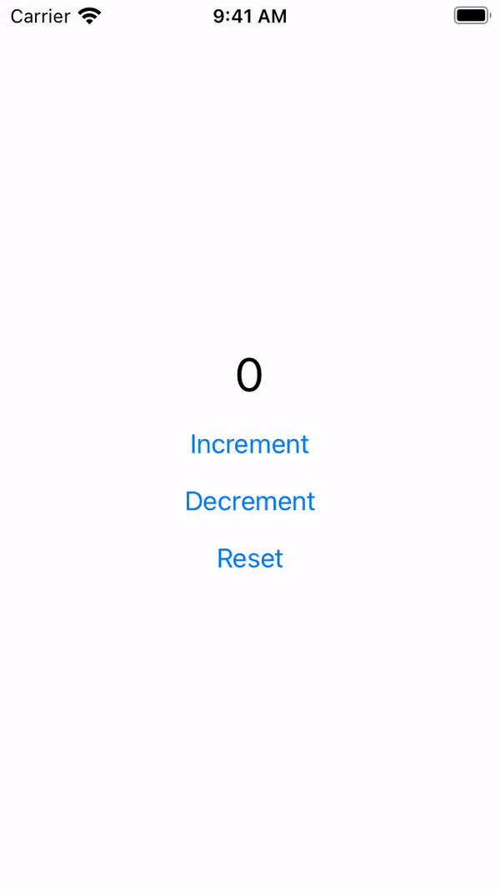
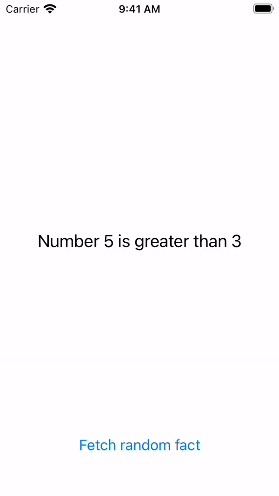

# Unidirectional Data Flow Examples

Example source code for the [Unidirectional Data Flow - iOS App Architecture](https://www.youtube.com/watch?v=eqHLw5naTrg) talk, presented on [Let Swift #22](https://fb.watch/622U2UdiKa/).

Xcode 12.5 project contains two example applications developed with [Swift Composable Architecture](http://github.com/pointfreeco/swift-composable-architecture/).

|CounterApp|FactsApp|
|:-:|:-:|
|||

## ➡️ More examples

- [Swift Composable App Example](https://github.com/darrarski/swift-composable-app-example)
- [Wallpapers Studio (iOS app)](https://github.com/darrarski/WallpapersStudio-iOS)
- [SwiftUI Navigation with Composable Architecture](https://github.com/darrarski/tca-swiftui-navigation-demo)

## ☕️ Do you like the project?

## 📄 License

Copyright © 2021 Dariusz Rybicki Darrarski

License: [MIT](LICENSE)
